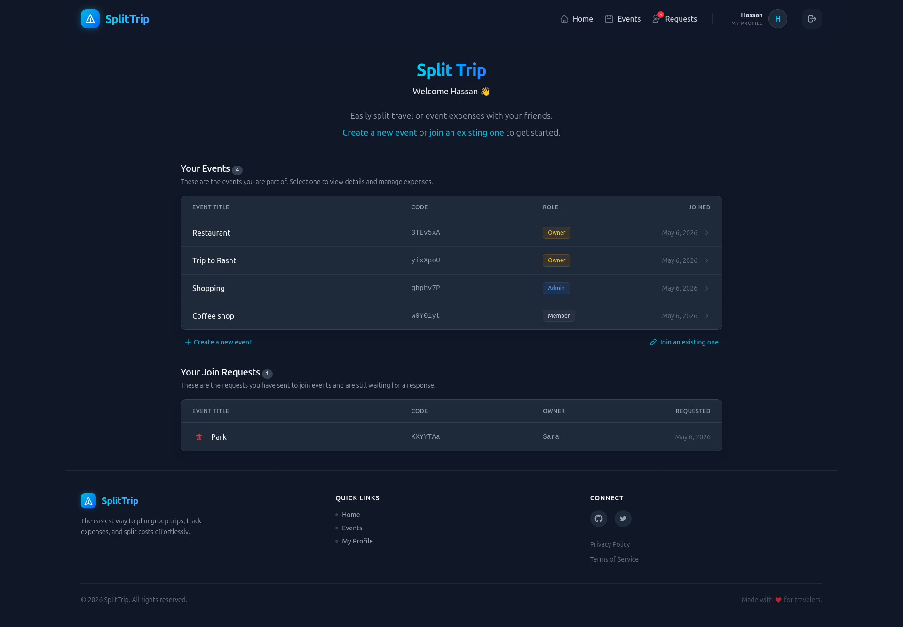
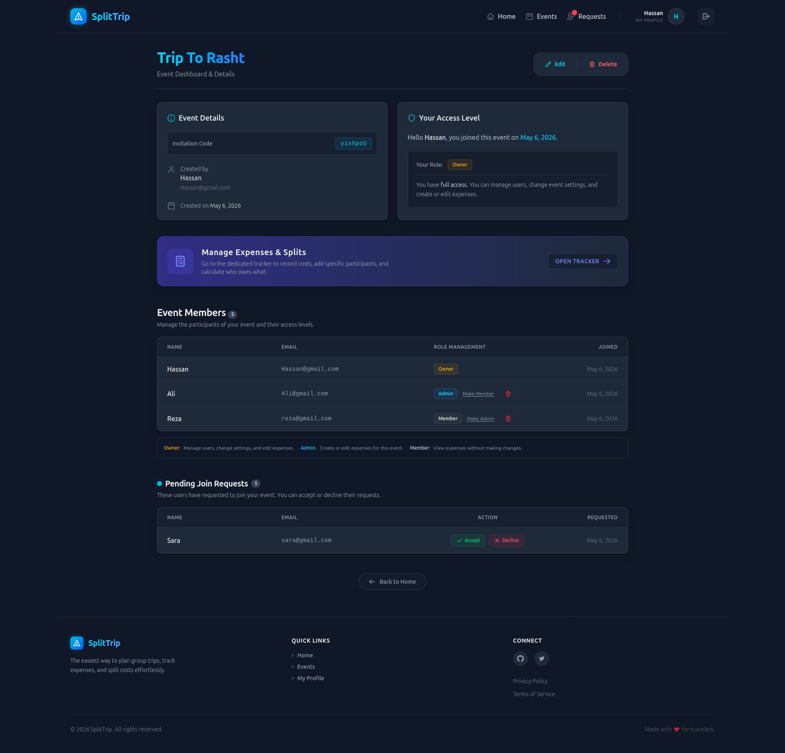
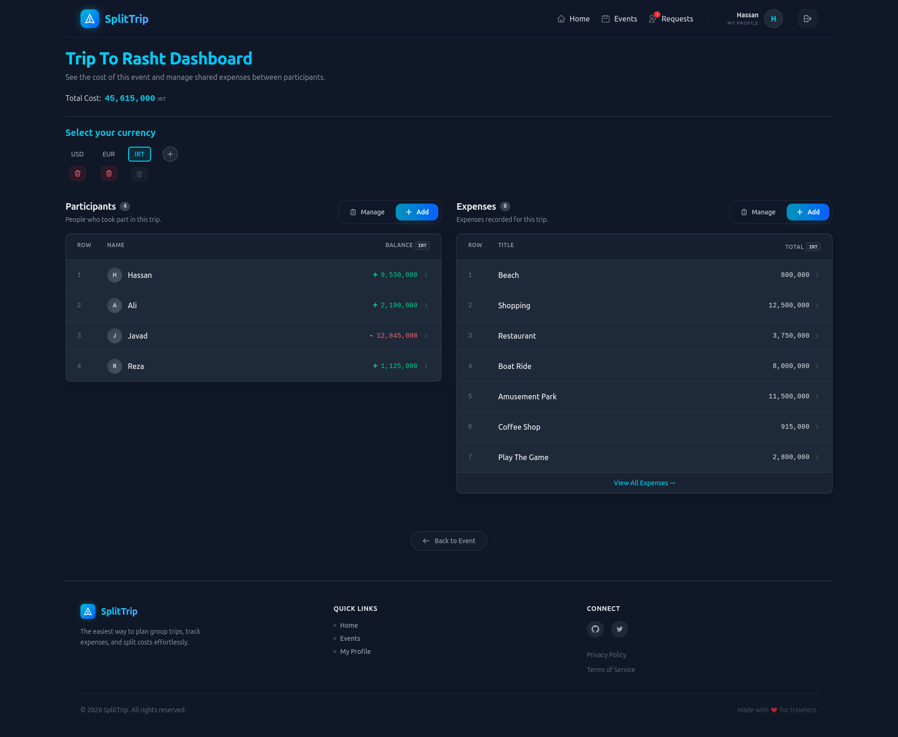
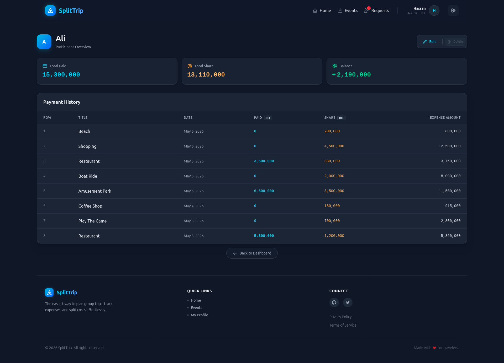
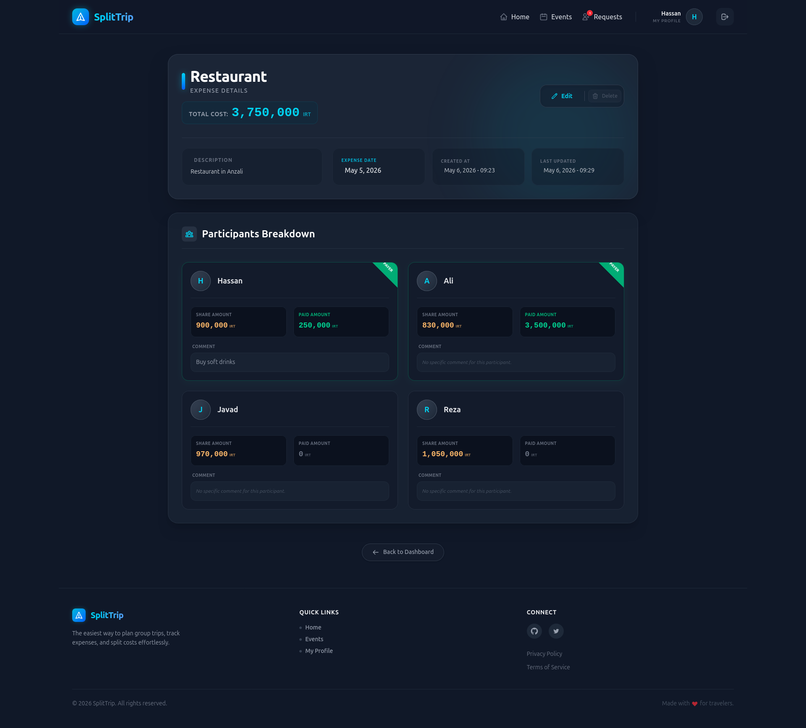

# Split Trip Expenses


A Django-based web application to manage and split trip expenses between participants.  
Users can create events (trips), invite or join other users, track participants, register expenses, and see who owes what.

---

## 📸 Screenshots

- Home (desktop): `screenshots/home.png`  
  
  
- Event (desktop): `screenshots/event.png`  
  

- Event Dashboard (desktop): `screenshots/event-dashboard.png`  
  
  
- Participant (desktop): `screenshots/participant.png`  
  
  
- Expense (desktop): `screenshots/expense.png`  
  

---

## ✨ Features

### 🔐 Authentication & Accounts

- Custom `User` model with email as the username field
- Email activation flow with:
  - Activation form & view
  - Retry delay mechanism (increasing delay based on failed attempts)
- Full auth flow:
  - Sign up
  - Login / Logout
  - Email activation
  - Password reset via email
  - Profile page, profile edit, and password change
- Prevent automatic login before email verification

### 🎟 Events & Membership

- Create events (trips) with unique event codes
- Automatic event code generation with collision handling and retry limit
- Event membership system:
  - `EventMembership` model linking users to events
  - Roles per member (creator / member)
  - Event owner can manage member roles and remove members
  - Members can leave events
- Join requests:
  - Users can send join requests for events
  - Event owner can accept or reject join requests
  - Join requests can be removed by owner or requester
- Home and Event pages show:
  - Event counters, members count, pending join requests
  - List views for events and join requests

### 💸 Expenses & Participants

- Participants:
  - `Participant` model linked to events
  - Create, edit, delete, and list participants
  - Individual participant detail page with expense history
  - Prevent removal of participants with non-zero balances
- Expenses:
  - `Expense` model linked to events and participants
  - Create and edit expenses (forms + views + templates)
  - Expense detail page
- Currency units:
  - `CurrencyUnit` model with active flag
  - Create / update / delete currencies
  - Select active currency on expenses dashboard
  - Display amounts based on selected currency
- Participant–expense relationship:
  - Unified `ParticipantExpense` model storing both `share_amount` and `paid_amount`
  - Unique constraint per (participant, expense)
  - Automatically update:
    - `Participant.total_share`, `Participant.total_paid`
    - `Expense.total_amount`
- Payments:
  - Split payment flow (2-step payment process)
  - Forms and views for split payments
  - JavaScript helpers for payment form handling

### 🧮 Access Control

- Access restrictions for expense and participant management:
  - Admin/owner can create and edit expenses and participants
  - Members have limited access to protected views
- `AccessRestrictedMixin` to protect certain views
- Frontend JS (`access_restricted.js`) to disable restricted UI controls

### 🌐 Web UI & UX

- Tailwind CSS-based responsive layout
- Site header and footer with navigation
- Dedicated pages for:
  - Home
  - Event dashboard
  - Expense dashboard
  - Participant list & detail
  - Join requests & members list
- Extensive use of partial templates and includes

### ⚙️ AJAX & UX Improvements

- AJAX support for:
  - Event members handling
  - Join requests handling
  - Currency selection in dashboard
  - Dynamic update of expenses and participants lists
- Hybrid JSON + HTML responses for richer front-end updates
- JavaScript helpers:
  - `ajax_handler.js`, `ajax_handler_currency.js`, `ajax_handler_payment_list.js`
  - `main_script.js` for price formatting
  - `expenses_list.js` for controlling UI state

### 🧪 Testing

- 18 unit tests covering:
  - `User` model:
    - Username generated from email
    - Default `is_email_active` value
    - Unique email constraint with `IntegrityError`
  - Event code generation:
    - Automatic code creation
    - Uniqueness
    - Collision resolution logic
  - Events:
    - `EventMembership` and `EventJoinRequest` models
    - Uniqueness constraints
    - `related_name` behaviors
  - Expenses:
    - `Participant` model creation
    - full_name–event uniqueness constraint
    - Reverse relations via `related_name`

### 🧰 Admin Panel

- Admin interface for:
  - All event-related models
  - Custom `User` model
- PostgreSQL configuration via environment variables
- `SECRET_KEY` loaded from `.env` (no hardcoded secret key)

---

## 🛠 Tech Stack

| Layer      | Technology                                        |
|------------|----------------------------------------------------|
| Backend    | Python 3.12, Django 5.1, Django REST Framework 3.17.1 |
| Frontend   | Django templates, Vanilla JavaScript               |
| Styling    | Tailwind CSS                                      |
| Database   | PostgreSQL 16                                     |

---

## 🔌 API Layer (DRF)

The project includes a REST API built on Django REST Framework:

- **Home API:**
  - Returns events, memberships, join requests for the authenticated user
- **Events APIs:**
  - Create event
  - List events
  - Retrieve event page data (including membership, join requests, members)
  - Update & delete events (only for creators; prevent deletion when expenses exist)
- **Join Requests APIs:**
  - Create join request
  - List user join requests
  - List join requests for a specific event
  - Accept / delete join requests (owner + requester restrictions)
- **Membership APIs:**
  - List event members
  - Update membership roles (only creator)
  - Delete membership (creator + owner with constraints)

> For a full list of endpoints and payloads, see `events/api_urls.py` and `expenses/api_urls.py`.

---

## 🚀 Getting Started

### Prerequisites

- Python 3.12
- PostgreSQL 16
- `virtualenv` (optional but recommended)

### Installation

1. **Clone the repository**
```bash
git clone https://github.com/hassan-ahmadi-jo/split-trip.git
cd splittrip

2. **Create and activate virtual environment**

bash
python -m venv venv

# Linux / macOS
source venv/bin/activate

# Windows
venv\Scripts\activate

3. **Install dependencies**

bash
pip install -r requirements.txt

4. **Configure environment variables**

Create a `.env` file in the project root:

bash
cp .env.example .env

Set at least the following values:

env
SECRET_KEY=your_django_secret_key
DEBUG=True

DB_NAME=splittrip
DB_USER=your_db_user
DB_PASSWORD=your_db_password
DB_HOST=localhost
DB_PORT=5432

5. **Apply migrations**

bash
python manage.py migrate

6. **Create a superuser (optional but recommended)**

bash
python manage.py createsuperuser

7. **Run the development server**

bash
python manage.py runserver

Open your browser at `http://127.0.0.1:8000/`.

---

## 🧪 Running Tests

bash
python manage.py test

Test Results:

text
Found 18 test(s).
Creating test database for alias 'default'...
System check identified no issues (0 silenced).
..................
----------------------------------------------------------------------
Ran 18 tests in 1.007s

OK
Destroying test database for alias 'default'...

---

## ⚠️ Notes

- The compiled Tailwind CSS file is included in the repository — no separate build step is required.
- Frontend JavaScript handles:
  - Menu toggles
  - Click-outside-to-close behavior
  - Price formatting
  - AJAX updates for lists and currency selection

---

## 📄 License

This project is for showcase purposes only.

All rights reserved — no permission is granted to use, copy, or distribute this code.

Author: Hassan Ahmadi

For questions or issues, please open a GitHub Issue.
